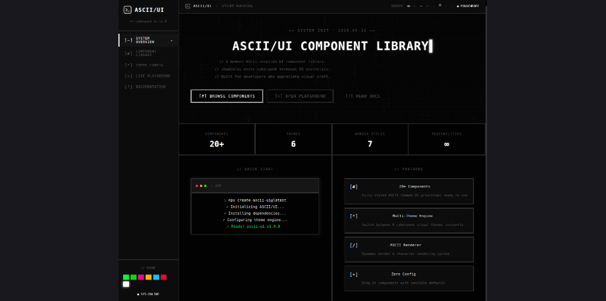
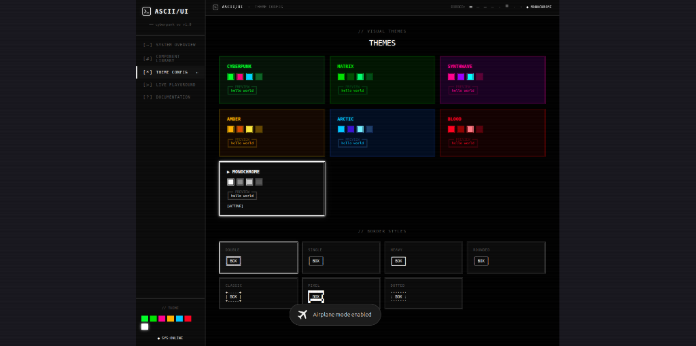

<div align="center">
  
  <h1 align="center">ASCII/UI</h1>
  <p align="center">
    <strong>A premium, futuristic terminal-inspired React design system.</strong>
  </p>
  <p align="center">
    <a href="https://ascii-ui.onrender.com/">Live Playground</a>
    ·
    <a href="#installation">Installation</a>
    ·
    <a href="#documentation">Documentation</a>
  </p>
</div>

<br />



**ASCII/UI** is an open-source, production-ready component library that merges the raw aesthetic of retro terminal OS interfaces with the powerful architecture of modern React design systems (like shadcn/ui and radix).

It features a massive ecosystem of 20+ fully customizable React primitives, a dynamic border rendering engine, and 6 hyper-stylized visual themes.

---

## ⚡ Features

- 📦 **20+ UI Primitives**: Fully styled ASCII-themed components ready to drop into your project (Cards, Terminals, Inputs, Modals, Progress Bars, Data Tables, and more).
- 🎨 **Multi-Theme Engine**: Switch instantly between 6 carefully curated cyberpunk color palettes (Cyberpunk, Matrix, Synthwave, Amber, Arctic, Blood, Monochrome).
- 🔳 **Dynamic Border System**: Global configuration engine supporting 7 completely different structural border rendering styles (Double, Single, Heavy, Rounded, Classic, Pixel, Dotted).
- 🧩 **shadcn/ui Architecture**: Built for absolute composability and developer experience.
- 🏗 **Monorepo Scale**: Architected using Turborepo and pnpm workspaces for infinite scalability.
- 💅 **Zero Config**: Sensible defaults with no complex CSS-in-JS configurations needed.

---

## 🚀 Live Playground

Experience the multi-theme engine and dynamic border styling in your browser:
👉 **[Open ASCII/UI Live Playground](https://ascii-ui.onrender.com/)**

---

## 💻 Installation

Install the core React package and its theme dependencies via your preferred package manager:

```bash
npm install @sreenandhanpp/ascii-ui @sreenandhanpp/ascii-ui-themes @sreenandhanpp/ascii-ui-engine
```

If you are using **pnpm** in a workspace:
```bash
pnpm add @sreenandhanpp/ascii-ui @sreenandhanpp/ascii-ui-themes @sreenandhanpp/ascii-ui-engine
```

---

## 🛠 Usage Example

ASCII/UI is designed to be incredibly simple to integrate. Just wrap your application in the `<AsciiUIProvider>` and start using the components!

```tsx
import React from 'react';
import { AsciiUIProvider, Button, Card, Terminal } from '@sreenandhanpp/ascii-ui';

function App() {
  return (
    <AsciiUIProvider theme="cyberpunk" borderStyle="double" density="high">
      <div className="layout-container">
        <Card title="SYSTEM.INIT" interactive>
          <p>Welcome to the grid.</p>
          <Button variant="primary" size="lg" glow>
            [>] EXECUTE SCRIPT
          </Button>
        </Card>
        
        <Terminal 
          title="— bash" 
          lines={[
            { type: "cmd", text: "npm run deploy" },
            { type: "ok", text: "✓ Mainframe compromised." }
          ]} 
        />
      </div>
    </AsciiUIProvider>
  );
}

export default App;
```

---

## 🎨 Theme Engine

ASCII/UI ships with a powerful theming engine that alters the entire structural appearance of the DOM contextually. 



### Available Themes
- `cyberpunk` (Default Green & Dark)
- `matrix` (Pure Hacker Green)
- `monochrome` (Stark Black & White)
- `synthwave` (Neon Pink & Purple)
- `amber` (Retro CRT Orange)
- `blood` (Dark Crimson)
- `arctic` (Cold Blue)

### Available Border Styles
- `double` (╔══╗)
- `single` (┌──┐)
- `heavy` (┏━━┓)
- `pixel` (Thick 4px solid lines)
- `dotted` (Modern 2px dotted outlines)
- `classic` (Traditional crosshair intersections)
- `rounded` (Modern radius hybrid)

---

## 🏗 Architecture

This project is structured as a scalable Turborepo ecosystem:

```text
ascii-ui-monorepo/
├── apps/
│   └── docs/                 # Interactive Vite showcase & playground
├── packages/
│   ├── ui/                   # @sreenandhanpp/ascii-ui (Core React components)
│   ├── cli/                  # ascii-ui-cli tool for adding components
│   ├── themes/               # @sreenandhanpp/ascii-ui-themes (Color variables and tokens)
│   └── ascii-engine/         # @sreenandhanpp/ascii-ui-engine (Border rendering logic)
```

---

## 🤝 Contributing

We welcome contributions! Please follow the Turborepo standard and ensure all packages build successfully before opening a PR.

```bash
# Install all dependencies
pnpm install

# Run the dev environment
pnpm dev

# Build the entire monorepo
pnpm build
```

---

<div align="center">
  <p>Built for developers who appreciate visual craft. 🖥️</p>
</div>
